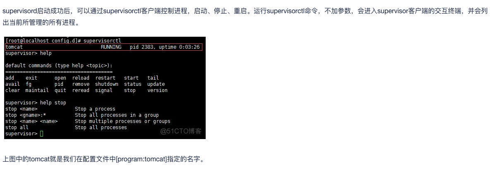

### 命令运行
```go
go run main.go  --env=local
```
热更新运行命令(推荐,无参数main.go默认设置local)
```go
air
```
### 接口文档

swag init 后访问http://localhost:3000/swagger/index.html#/


nginx已部署:
### 编译并运行
项目目录下执行
go build main.go
nohup ./main(旧,建议直接使用宝塔守护进程)

### 停止
lsof -i :3000
kill -9 pid


nohup用法资料链接https://zhuanlan.zhihu.com/p/490632944?utm_id=0


supervisor 守护进程
supervisor配置文件在:/etc/supervisord.conf
gohub单独项目配置在:/etc/supervisor/config.d/gohub.ini


配置参考:
```
```go
[program:gohub] ;gohub叫进程名
directory=/root/mydata/gohub;项目目录
command=/root/mydata/gohub/main ;项目目录+二进制文件
autostart=true 
autorestart=true;当程序崩溃时就会重启
stderr_logfile=/var/log/main.err;错误日志
stdout_logfile=/var/log/main.log;终端打印日志 
```
如果改了配置文件重启命令
```go
sudo supervisorctl reload
```
终端命名:


关于发布方式:
2024年03月22日已配置宝塔supervisor守护进程
更新方法:1.go build main.go 2.重启守护进程或者sudo supervisorctl reload

宝塔守护进程工程:
```
[program:gohub]
command=/root/gohub/main
directory=/root/gohub
autorestart=true
startsecs=3
startretries=3
stdout_logfile=/www/server/panel/plugin/supervisor/log/gohub.out.log
stderr_logfile=/www/server/panel/plugin/supervisor/log/gohub.err.log
stdout_logfile_maxbytes=2MB
stderr_logfile_maxbytes=2MB
user=root
priority=999
numprocs=1
process_name=%(program_name)s_%(process_num)02d
```